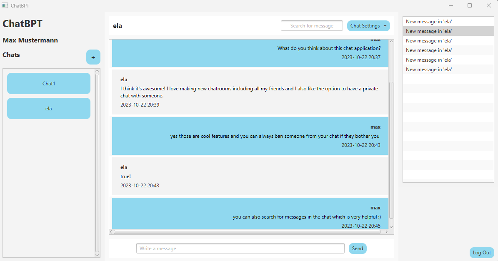

# Chat Application

## About
ChatBPT is a simple, RMI-based Chat Application. Users can log in or sign up and then create private chats as well as public chatrooms 
where other users can be added to or join themselves. The owner of a chat can ban and unban users and delete the chat. 
The users can search for messages in the chats and can change the maximum number of messages that are shown.
There is a little window which shows system messages (e.g. when a user joins a chatroom).


## Setup
Run the following command and run the scripts to set up the database with some test input.
```shell
cd scripts  
.\start-mysql-server.ps1 
.\create-schema.ps1
.\insert-schema.ps1
```
After setting up the database, the ChatServer can be started as well as any number of ChatClients.


There are two test users already in the database which provide some test data:
- max (password: max)
- ela (password: ela)




